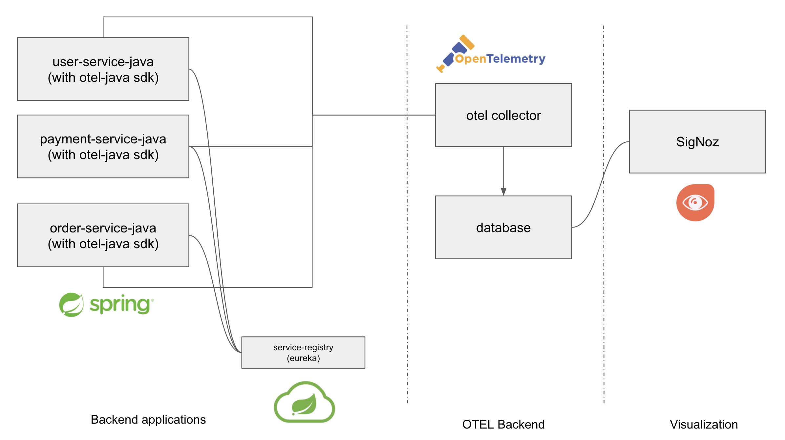
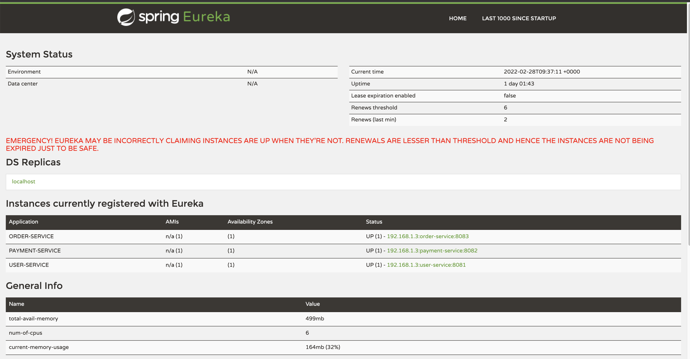
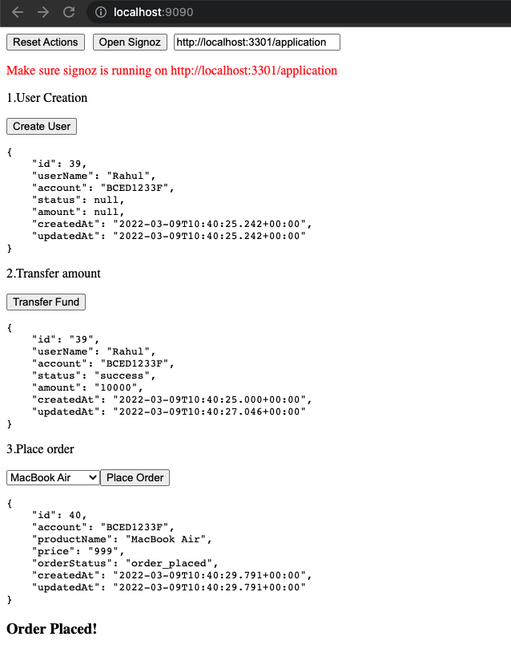

### Distributed Tracing Java Sample

This project demonstrates how to implement distributed tracing in java spring boot application with the help for below microservices

- [order-service](order-service)
- [payment-service](payment-service)
- [user-service](user-service)

### Tracing flow



### Running the code

This application require Eureka service registry

```
cd discovery-server
mvn clean install -Dmaven.test.skip
docker build -t discovery-service:1.0.1 .
docker run -d --name discovery-service -p 8761:8761 discovery-service:1.0.1
```

Run `http://localhost:8761`



Start individual microservice using below commands

1. UserService

```
cd user-service
mvn clean install -Dmaven.test.skip
sh ./script/start.sh

```

2. OrderService

```
cd order-service
mvn clean install -Dmaven.test.skip
sh ./script/start.sh

```

3. PaymentService

```
cd payment-service
mvn clean install -Dmaven.test.skip
sh ./script/start.sh

```

4. Demo UI

To capture traces from above microservice run the [sample-ui](ui) application using below commands

```
npm install -g serve
serve -l 9090 ui
```

Open http://localhost:9090 and perform actions that will capture traces to signoz



View traces, logs and metrics:

- View the metrics in signoz, go to http://localhost:3301/application
